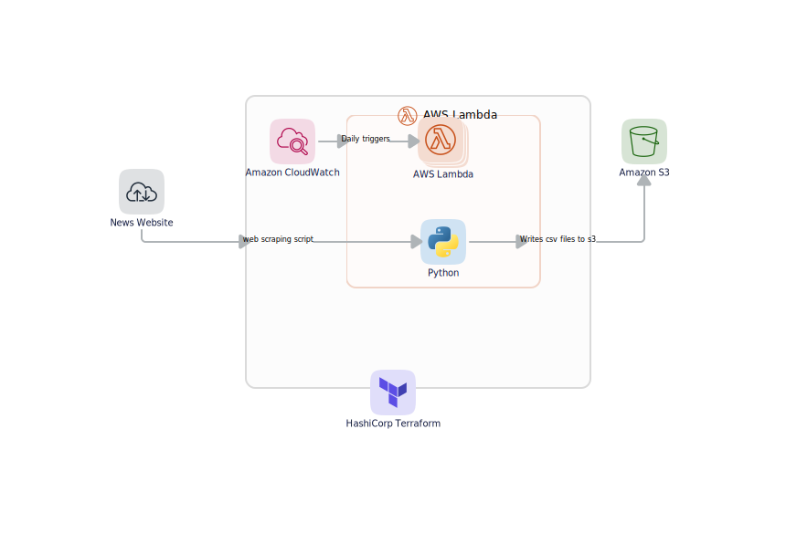

# ETL-assignment

## Diagram flow explanation


Data is scrapped from the news website using the python packages
like beautifulsoup, selenium.
The scrapped data is written into a csv file in this format
```
id, date, author, publisher, category, text
```

The datatypes of the columns are 
id - int,
date - datetime,
author - string,
publisher - string,
category -  string,
text - string

The Amazon Cloudwatch alarms is used to trigger lambda script daily.
The csv files are stored in the s3 bucket which can be easily 
accessed by data scientist for modeling or analytics.


